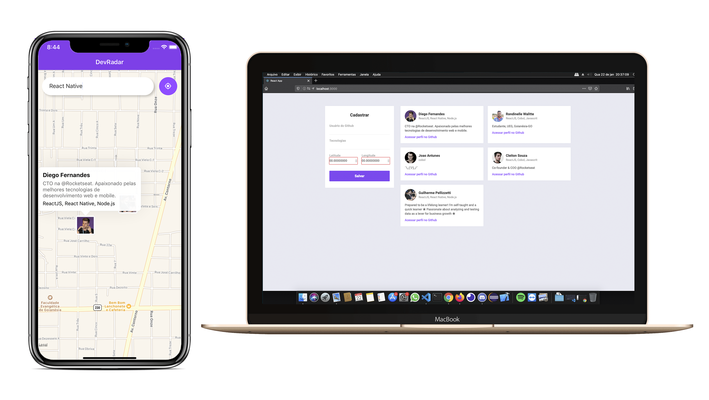

<h1 align="center">
      
</h1>

<p align="center">
  <a href="#rocket-tecnologias">Tecnologias</a>&nbsp;&nbsp;&nbsp;|&nbsp;&nbsp;&nbsp;
  <a href="#computer-projeto">Projeto</a>&nbsp;&nbsp;&nbsp;|&nbsp;&nbsp;&nbsp;
  <a href="#inbox_tray-download">Download</a>&nbsp;&nbsp;&nbsp;|&nbsp;&nbsp;&nbsp;
  <a href="#hammer_and_wrench-instalando">Instalando</a>&nbsp;&nbsp;&nbsp;|&nbsp;&nbsp;&nbsp;
  <a href="#memo-licença">Licença</a>
</p>

<br>

<p align="center">
  
</p>

## :rocket: Tecnologias

Esse projeto foi desenvolvido com as seguintes tecnologias:

- [Node.js](https://nodejs.org/en/)
- [ReactJS](https://reactjs.org)
- [React Native](https://facebook.github.io/react-native/)
- [Expo](https://expo.io/)

## :computer: Projeto
Composto de 3 partes, back-end, Web e Mobile, onde desenvolvedores, se cadastram no Web e disponibiliza seu contando no GitHub e sua localização baseada no navegador, colocando também as tecnologias que o mesmo trabalha atualmente, na parte mobile de forma automática e em Real Time com o Web, você pode filtrar e buscar outros devs em uma distância de até 10km, visualizando no maps a localização e as tecnologias que o mesmo trabalha, clicando no dev o perfil do GitHub abre. Na parte do back-end a api RESTful feita nos padrões MVC, comunicando com os apps "android e ios" e  a parte Web.


## :inbox_tray: Download

Abra seu terminal e de um git clone
```
git clone https://github.com/rondinellewalitte/Semana_OmniStack_10.0.git
```
## :hammer_and_wrench: Instalando back-end :

```
cd Semana_OmniStack_10.0
```
```
cd backend
```
```
yarn install
```
@obs: Se sua maquina nao tiver o yarn instalado pode instalar atraves desse link:
[Install Yarn](https://yarnpkg.com/en/docs/install)
### Executando backend :
```
yarn dev
```
## :tv: Instalando Web :

```
cd Semana_OmniStack_10.0
```
```
cd web
```
```
yarn install
```
@obs: Se sua maquina nao tiver o yarn instalado pode instalar atraves desse link:
[Install Yarn](https://yarnpkg.com/en/docs/install)
### Executando Web :
```
yarn start
```

## :iphone: Instalando Mobile :

```
cd Semana_OmniStack_10.0
```
```
cd mobile
```
```
yarn install
```
@obs: Se sua maquina nao tiver o yarn instalado pode instalar atraves desse link:
[Install Yarn](https://yarnpkg.com/en/docs/install)
### Executando Mobile :
```
yarn start
```


## :memo: Licença

Esse projeto está sob a licença MIT. Veja o arquivo [LICENSE](LICENSE.md) para mais detalhes.

---
